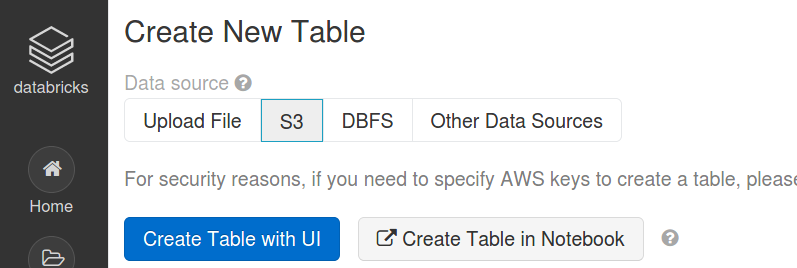
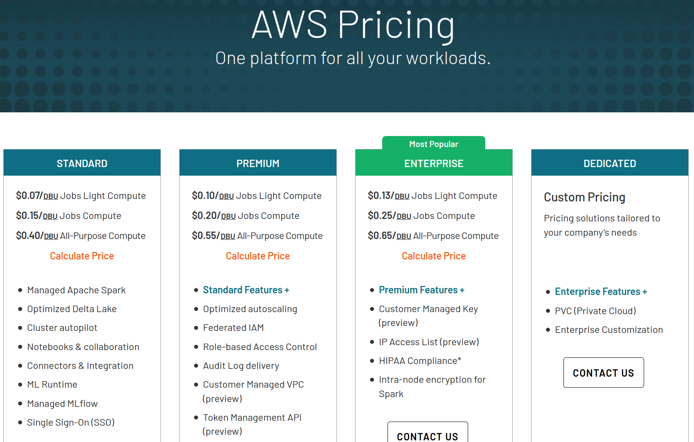
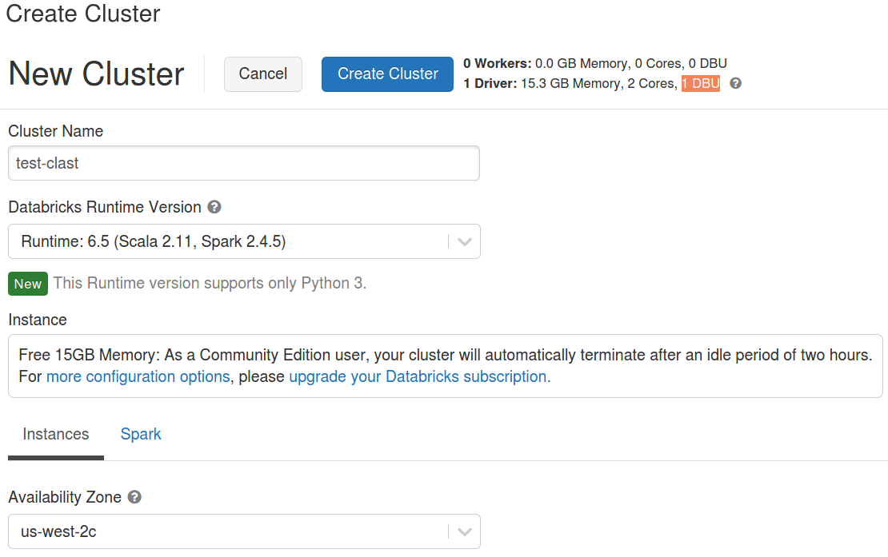
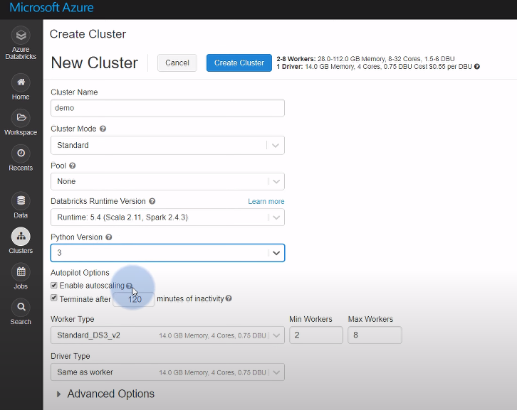
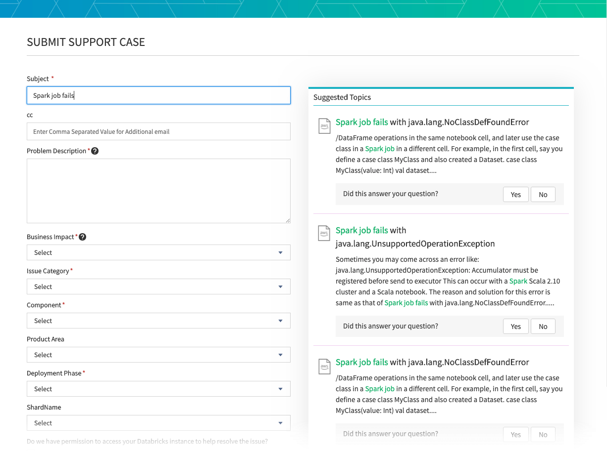
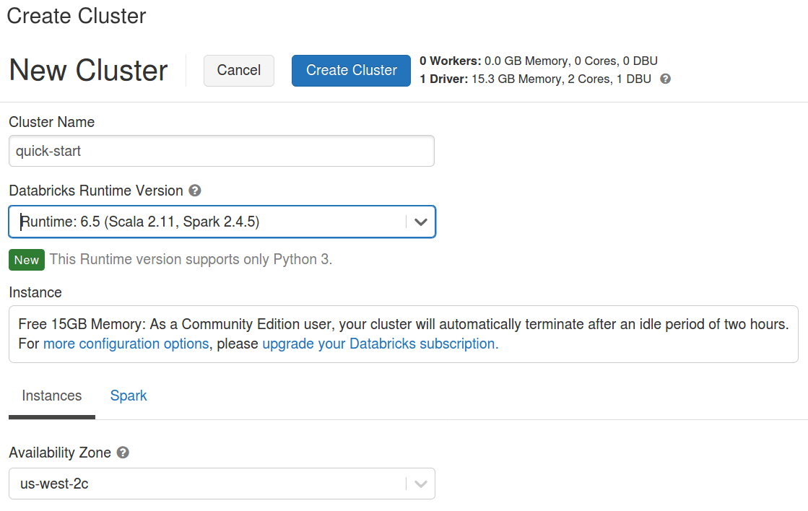
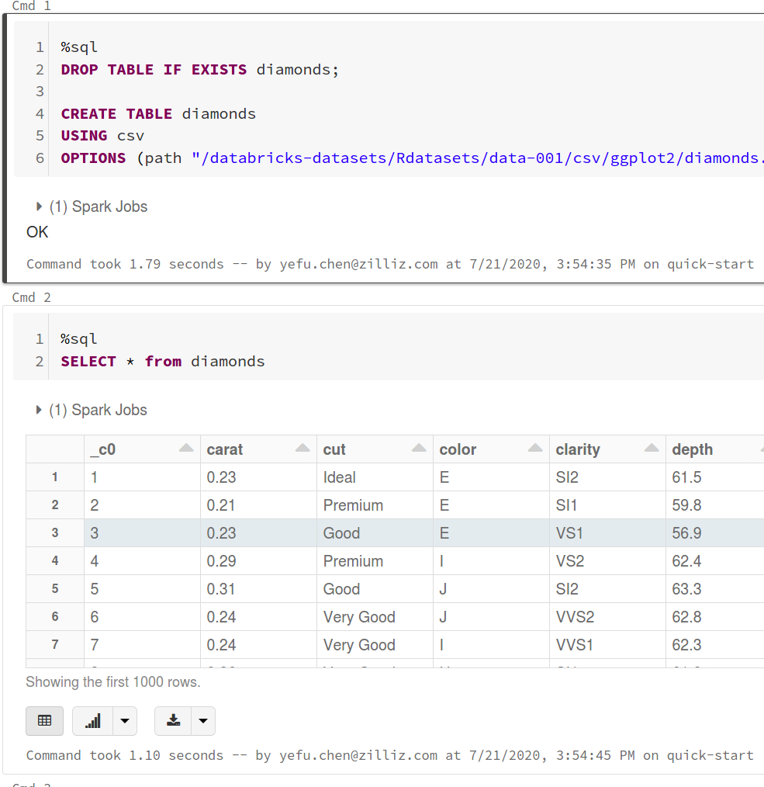
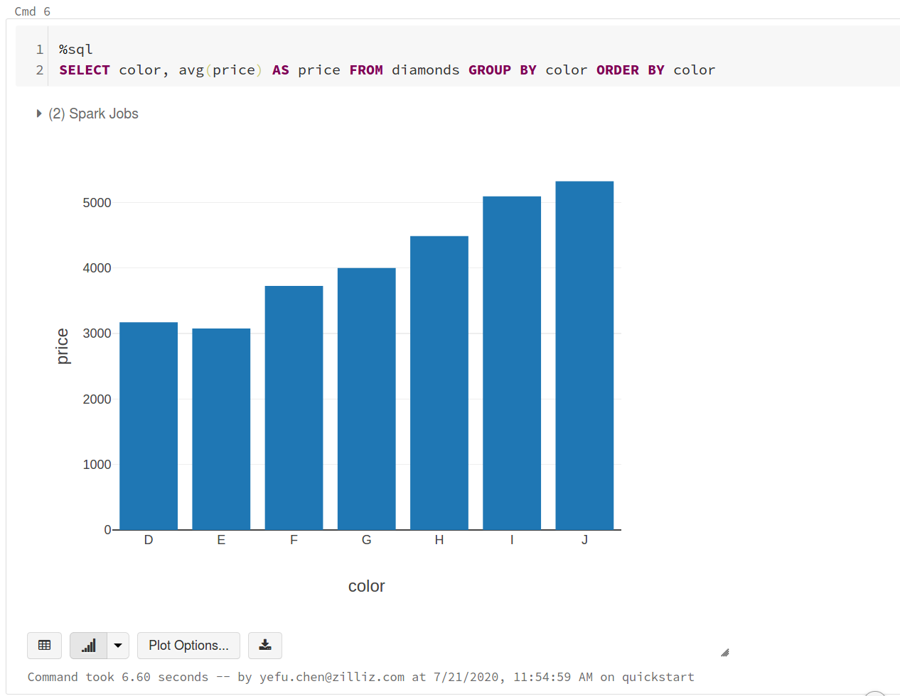

# Databricks Spark
## Paper (01 High)
TODO

---

## Independent Entrance
- 社区版(免费): https://community.cloud.databricks.com/login.html
- Azure Databricks: https://databricks.com/product/azure
- Aws Databricks: https://databricks.com/aws

Azure 和 Aws 版注册需要绑定行用卡

---

## Cloud Infra
- Azure
- Aws

## Infra dependency
No

不依赖云平台的特定硬件，但是支持从 `S3` 上加载数据

---

## SLA
没找到 `Databricks` 的 `SLA` 协议，有 `Azure Databricks` 的 `SLA` 协议，是2018年3月的

`Azure Databricks SLA` : https://azure.microsoft.com/en-us/support/legal/sla/databricks/v1_0/

`AWS` 并没有单独针对 `spark` 的 `SLA` 协议，但是有整体的 `SLA` 协议

`ASW SLA` : https://aws.amazon.com/compute/sla/

---

## Product package
提供 `notebook` 的操作页面，同时整合了 `MLflow`

与传统的基于 `python` 的 `notebook` 不同，这里的 `notebook` 的编程语言可以是 `python`、`scala`、`SQL`和`R`

---

## Pricing model

https://databricks.com/product/pricing

价格模型包含两部分，`Spark`使用费用和云服务厂商的费用

`Azure Databricks`的价格模型: https://databricks.com/product/azure-pricing

`AWS Databricks`的价格模型：https://databricks.com/product/aws-pricing

`DBU`为spark的计价单元

在创建 `spark` 计算集群时会显示当前集群的 `DBU`

这里演示的是社区免费版本，所以只有一个 `Driver` 节点没有 `Worker` 也不能选择机器配置和数目

这个视频演示了 `Azure Databricks` 的使用： https://www.youtube.com/watch?v=M7t1T1Q5MNc

在这个演示中可以选择机器的配置及数目，不同的配置对应不同的 `DBU`

---

## 7x24 Support
Databricks supports : https://docs.databricks.com/support.html

未找到关于 `7x24` 支持的说明，但是可以在页面上提交任务寻求官方支持

---

## Competition (02 Medium)
TODO

---

## Authentication
登录后有个独立的操作页面，在页面上创建 `Notebook` 进行数据分析

首先需要创建 `Cluster`

显示当前可用的集群

创建 `notebook` 任务

创建 `notebook` 时，需要制定默认的编程语言及当前 `notebook` 在那个集群上运行

之后可以像本地使用 `notebook` 一样操作 `spark`

直接以图表的方式显示数据

---

## Scale out
Yes，详见 `Pricing model`

---

## HA
Yes，详见 `SLA`

---

## DR
`Spark`只针对数据分析，不提供数据备份及回复的操作

## Scale up
Yes，详见 `SLA`

---

## Serverless (03 low)
TODO

---

## Disaggregated Storage and Compute Architecture (03 low)
TODO 

---

## User Management

Yes, 详见 `Authentication`

---

## Regulation/Compliance (01 High)
TODO