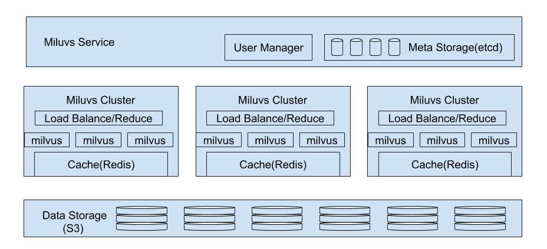
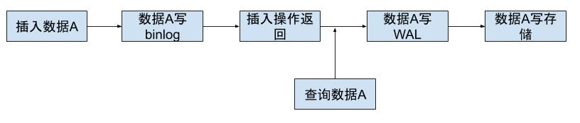
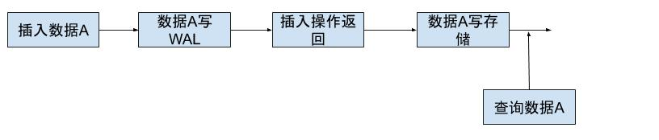
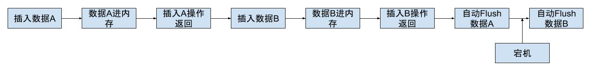

# Miluvs 云方案的思考

本方案参考 snowflake，整体框架图如下：

---

## meta server为什么是全局的，为什么不是一个miluvs cluster一个meta server?
- meta server 采用etcd，为了保证数据可靠不丢失，至少3台机器，一个miluvs cluster 一套meata server 太费钱， 全局meta server比较节约
- meta数据量比较少，一套全局的 meta server足够支撑服务
- .如果业务迅速扩展导致一套全局的meta server不足以支撑服务，可以部署多个meta server，每个meta server分别负责多个 milvus cluser

---

## 存储端为什么不用Raft?
- Vearch使用 raft 实现，256维度，float，插入1万条，耗时26s，太慢
- 测试环境为办公室的台式机，相同配置，milvus 插入10万条，耗时4s

---

## 为什么选择 S3作为storage?
- snowflake的论文对S3做了一番调研，并且提到S3 是 “ hard to beat”
- snowflake针对的场景是OLAP，即数据批量导入，并且delete 和 update 为低频操作，milvus的使用环境满足这种假设

---

## S3中存什么?
- 原始的向量数据 raw data
- 向量索引文件 index data
- 数据删除记录 delete doc

---

## storage中为什么存删除记录而不是直接将数据删除
- 如果数据直接从 storage 中删除，那么索引文件需要重新构建，太费时
- 在 milvus 假设的使用场景中，删除属于低频操作，存储删除记录不影响查询性能

---

## milvus cluster 中的 load balance 和 reduce是干什么的？
- load balance和reduce分别对应这milvus cluster的两种工作模式
- load balance模式中，milvus cluster中的每个 milvus实例都拥有全量数据，针对提高QPS
- reduce中，每个milvus实例拥有部分数据，针对超大数据集查询
- load balance和reduce不能同时工作

---

## 为什么不在 milvus cluster前端接入 kafka 做数据分发
- kafka的高可用需要引入 `zookeeper`，这样需要3台机器做`kafka`，3台机器做`zookeeper`，太费钱
- 在 milvus cluster 前端接入 `kafka` 目前能看到的直接效果是为后续的`数据统计`和`数据审计`解耦，这两个功能直接从 `kafka` 订阅消息
- `数据统计`和`数据审计`也可以直接从 `storage` 读数据，也是和 milvus 解耦的
- `kafka`是`scala`技术栈，对于当前公司的团队来说，存在运维难度
- 如果后期确实需要加入`kafaka`，当前的设计框架也是容易加入的

---

## 当前milvus需要哪些改变，针对即将发布的 milvus-0.11.0？
- 必须做到计算和存储分离
- 使用etcd存储meta
- 删除 WAL
- 删除自动flush
- delete 操作也需要 flush才能生效
- milvus cloud需要自动升级，那么milvus后续版本的数据格式必须向后兼容
- 数据文件需要有校验
- 增加与S3的交互接口，从S3加载数据，并将数据存入S3
- milvus 的文件名需要包含 meta 信息，能够自解析生成 meta

---

## 为什么要删除当前 milvus 中的 WAL
- `WAL` 应该是存储层面的事，数据库层面应该是 `binlog`，当前 milvus　的 `WAL` 即不属于传统存储的 `WAL` 也不属于数据库层面的　`binlog`，感觉怪怪的
- 传统意义上的 `WAL` 和 `binlog` 关系如下图所示，用户插入数据A时，数据库首先将数据A写`binlog`，然后向用户客户端返回插入操作，此时对用户来说插入操作已经结束了，用户可以在通过`query`查询数据A；数据库后台程序将数据A先写入`WAL`，再写入持久化存储

- 当前 milvus 的 `WAL` 流程图如下所示，用户插入数据A时，数据库首先将数据A写`WAL`，然后向用户返回插入操作，对用户来说此时插入操作已经结束了，**`但是此时用户依然无法查询数据A，数据A必须在调用 flush 写入持久化存储后才能被用户查询`**

- `S3`是只读，不允许向文件中追加内容，如果依然存在 `WAL`，就会导致一个插入操作，对应`S3`中的而一个文件，这个设计太傻了
- 如果 `WAL` 不写入 `S3`，而是写入本地缓存，那么没法保证宕机后回复数据

---

## 为什么要删除自动 flush
- 当前 milvus 数据插入流程是这样的：
    - 用户调用 insert 接口插入数据
    - 结合前一条删除`WAL`， 此处假设milvus 将数据写入内存，并向用户返回插入结束
    - 但是此时不能保证用户一定查询刚刚写入的数据
    - milvus 内置定时自动 `flush`
    - 只有当数据被 `flush` 磁盘后，用户才能查询
- 首先这个流程有个语义上的困惑， 在用户层面上以为插入已经接受，但是 milvus 并不保证用户一定能查询到刚刚插入的数据
- 更重要的原因在于自动 `flush` 的 milvus 是有状态的，如果在 自动`flush` 过程中宕机则无法实现数据恢复，如下图所示，用户认为数据A和数据B均已进milvus，当时在宕机恢复后，用户只能有数据A没有数据B，数据B已经丢失了

- 结合 milvus 适合数据批量插入的使用场景，我们认为 `flush` 的语义应该是传统数据的 `commit`
    - 用户必须手动调用 `flush`
    - 只有在 `flush` 返回成功后，`flush` 之前的 `insert` 和 `delete` 操作才是有效的
    - milvus 保证两个 `flush` 之间的 `insert` 和 `delete` 操作要么全部成功，那么全部失败
- 删除 milvus 的 `WAL` 和 `自动flush` 是 milvus 实现计算和存储分离的重要步骤

---

## 文件名需要包含 meta 信息，能够自解析生成 meta
- 按照一下文的收费模式，milvus cluster 按照使用时长收费，并且可以挂起
- 当 milvus cluster 挂起后，其对应的 meta 信息需要从 etcd 中删除
- milvus cluster 激活后根据文件名，自动生成 meta信息存入 etcd

---

## 插入数据流程
-

---

## milvus cluster 中 Cache 干什么用？
-

---

## 删除流程
-

---

## 计费模式?
- 仿照 snowflake，storage和 milvus cluster单独收费
- 用户只购买 milvus cluster的服务，并不购买 storage服务
- milvus cluster 可以选择机器配置及机器数目，不同的配置对应不同的单价
- 学 snowflake，milvus cluster 按照使用时长收费
- Storage的收费模式学snowflake，按照每个月的平均存储量计算

---

## 计算资源是否可以挂起?
- 学 snowflake，milvus cluster可以挂起
- 创建 milvus cluster时可以设置运行一段时间后自动挂起
- 和snowflake一样，自动挂起需要对应这自动恢复，在milvus cloud收到第一条查询查询指令时，自动恢复最近被被挂起的 milvus cluster
- milvus cluster恢复后，内存中并没有数据，因此第一次查询会比较缓慢
- 一个用户可以创建多个不同配置的 milvus cluster，但是在同一时间，只能有一个 milvus cluster 处于活跃状态，其它均为挂起状态
- milvus cluster 挂起时，`Cache` 中的内容需要写入 `Storage`

---

## 是否提供免费的试用途径?
- 提供免费的试用途径
- 用户登录后，在购买milvus cluster时，可以选择免费版本的free cluster
- free cluster只有一个milvus实例，并且限制 memory 和 storage 的使用量
- free cluster的目标人群是milvus 用户中的开发人员，使用free cluster做接口调试，mongodb中的M0也是这么设定的
- free cluster在创建后2小时内自动挂起，因为挂起的 milvus cluster 在收到查询指令后会自动回复，所以对开发人员而言是透明的

---

## 用户管理模式?
- 仿照 snowflake，用户管理分两级 account 和 user
- 每个account有独立的URL
- 一个account下可以有多个user，这些user共享一份账单
- 因为当前的milvus并不具备用户管理的能力，所以这个功能可能需要放在 milvus service中的
