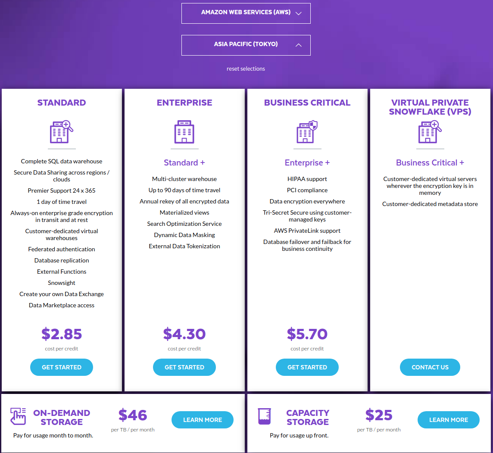
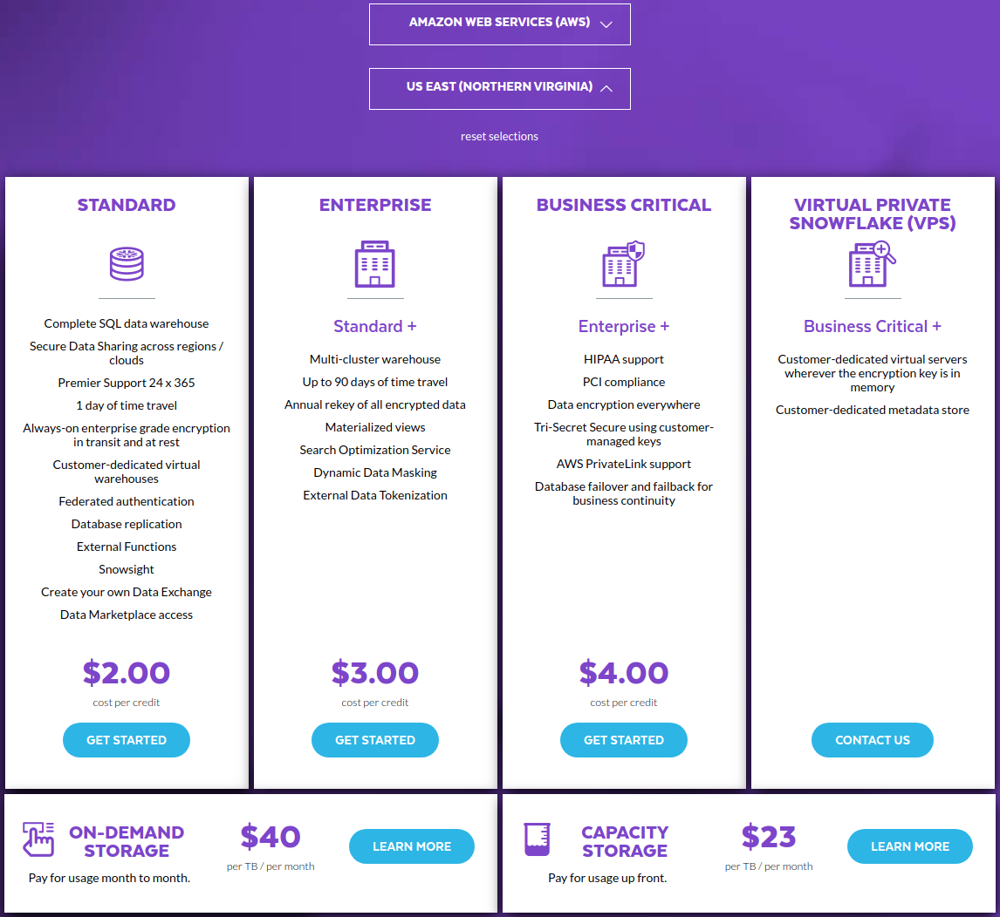

# Snowflake
## Paper (01 High)
TODO

---

## Independent Entrance
官网地址: https://www.snowflake.com/


---

## Cloud Infra
注册时可以选择云厂商，以及区域


---

## Infra dependency
不依赖云平台，但是提供额外的直接从 `S3` 查询的功能

---

## SLA

https://www.snowflake.com/wp-content/uploads/2019/02/Snowflake-Support-Policy-02202019.pdf


## Product package

TODO

---

## Pricing model

https://www.snowflake.com/pricing/

`Snowflake` 包含 存储、计算和云服务，价格也按照这三部分单独计算


`CREDIT` 是 `snowflake` 的计价单位


不同云平台及不同区域的 `Credit` 价格不一样

`AWS` 东京



`AWS` 弗吉尼亚北


计算资源消耗的 `credit`


---

## 7x24 Support
Yes, `Pricing model` 内包好了 `Premier Support 24x365`

---

## Competition (02 Medium)
TODO

---

## Authentication

`Snowflake`包含两层概念，`account` 和 `user`

每个 `account` 有个独立的 `URL`: https://ck58372.ap-northeast-1.aws.snowflakecomputing.com/console/login

在登录页面输入 `user` 和 `password`


登录后的 `WebUI` 页面


除了网页登录, `snowflake` 还支持直接命令行直接登录: https://docs.snowflake.com/en/user-guide/snowsql.html#

这只配置文件
```ini
[connections.cyf]
accountname = ck58372.ap-northeast-1.aws 
username = cyf 
password = @Password123
```
`snowsql` 登录
```sql
root@1ffbf9c23137:~# snowsql -c cyf
* SnowSQL * v1.2.7
Type SQL statements or !help
cyf#COMPUTE_WH@(no database).(no schema)>show DATABASES;
+-------------------------------+-----------------------+------------+------------+-------------------------+--------------+----------------------------+---------+----------------+
| created_on                    | name                  | is_default | is_current | origin                  | owner        | comment                    | options | retention_time |
|-------------------------------+-----------------------+------------+------------+-------------------------+--------------+----------------------------+---------+----------------|
| 2020-07-23 00:02:05.582 -0700 | CITIBIKE              | N          | N          |                         | SYSADMIN     |                            |         | 1              |
| 2020-07-22 23:11:46.095 -0700 | DEMO_DB               | N          | N          |                         | SYSADMIN     | demo database              |         | 1              |
| 2020-07-22 23:11:48.160 -0700 | SNOWFLAKE_SAMPLE_DATA | N          | N          | SFC_SAMPLES.SAMPLE_DATA | ACCOUNTADMIN | TPC-H, OpenWeatherMap, etc |         | 1              |
| 2020-07-22 23:11:35.897 -0700 | UTIL_DB               | N          | N          |                         | SYSADMIN     | utility database           |         | 1              |
| 2020-07-23 00:33:59.506 -0700 | WEATHER               | N          | N          |                         | SYSADMIN     |                            |         | 1              |
+-------------------------------+-----------------------+------------+------------+-------------------------+--------------+----------------------------+---------+----------------+
5 Row(s) produced. Time Elapsed: 0.235s
cyf#COMPUTE_WH@(no database).(no schema)>use CITIBIKE;
+----------------------------------+                                            
| status                           |
|----------------------------------|
| Statement executed successfully. |
+----------------------------------+
1 Row(s) produced. Time Elapsed: 0.180s
cyf#COMPUTE_WH@CITIBIKE.PUBLIC>show TABLES;
+-------------------------------+-----------+---------------+-------------+-------+---------+------------+----------+------------+----------+----------------+----------------------+-----------------+
| created_on                    | name      | database_name | schema_name | kind  | comment | cluster_by |     rows |      bytes | owner    | retention_time | automatic_clustering | change_tracking |
|-------------------------------+-----------+---------------+-------------+-------+---------+------------+----------+------------+----------+----------------+----------------------+-----------------|
| 2020-07-23 00:44:12.960 -0700 | TRIPS     | CITIBIKE      | PUBLIC      | TABLE |         |            | 61468359 | 1767365632 | SYSADMIN | 1              | OFF                  | OFF             |
| 2020-07-23 00:30:39.687 -0700 | TRIPS_DEV | CITIBIKE      | PUBLIC      | TABLE |         |            | 61468359 | 1761240576 | SYSADMIN | 1              | OFF                  | OFF             |
+-------------------------------+-----------+---------------+-------------+-------+---------+------------+----------+------------+----------+----------------+----------------------+-----------------+
2 Row(s) produced. Time Elapsed: 0.188s
cyf#COMPUTE_WH@CITIBIKE.PUBLIC>select * from TRIPS limit 20;
+--------------+-------------------------+-------------------------+------------------+--------------------------+------------------------+-------------------------+----------------+-----------------------------+----------------------+-----------------------+--------+--------------------------------------+------------+------------+--------+
| TRIPDURATION | STARTTIME               | STOPTIME                | START_STATION_ID | START_STATION_NAME       | START_STATION_LATITUDE | START_STATION_LONGITUDE | END_STATION_ID | END_STATION_NAME            | END_STATION_LATITUDE | END_STATION_LONGITUDE | BIKEID | MEMBERSHIP_TYPE                      | USERTYPE   | BIRTH_YEAR | GENDER |
|--------------+-------------------------+-------------------------+------------------+--------------------------+------------------------+-------------------------+----------------+-----------------------------+----------------------+-----------------------+--------+--------------------------------------+------------+------------+--------|
|          406 | 2018-04-27 15:59:08.000 | 2018-04-27 16:05:54.000 |               79 | Franklin St & W Broadway |           40.71911552  |           -74.00666661  |            128 | MacDougal St & Prince St    |         40.72710258  |         -74.00297088  |  31783 | Annual Membership                    | Subscriber |       1997 |      2 |
|          641 | 2018-04-27 15:59:08.000 | 2018-04-27 16:09:50.000 |              387 | Centre St & Chambers St  |           40.71273266  |           -74.0046073   |            248 | Laight St & Hudson St       |         40.72185379  |         -74.00771779  |  33402 | Annual Membership from Citi Bike App | Subscriber |       1988 |      1 |
|          386 | 2018-04-27 15:59:11.000 | 2018-04-27 16:05:38.000 |             3660 | W 16 St & 8 Ave          |           40.741021509 |           -74.001384974 |            494 | W 26 St & 8 Ave             |         40.74734825  |         -73.99723551  |  33473 | Annual Membership                    | Subscriber |       1962 |      1 |
|          503 | 2018-04-27 15:59:12.000 | 2018-04-27 16:07:36.000 |              465 | Broadway & W 41 St       |           40.75513557  |           -73.98658032  |            480 | W 53 St & 10 Ave            |         40.76669671  |         -73.99061728  |  16653 | Annual Membership                    | Subscriber |       1956 |      1 |
|          167 | 2018-04-27 15:59:13.000 | 2018-04-27 16:02:01.000 |              482 | W 15 St & 7 Ave          |           40.73935542  |           -73.99931783  |           3472 | W 15 St & 10 Ave            |         40.742753829 |         -74.007473588 |  31276 | Annual Membership                    | Subscriber |       1988 |      1 |
|         1693 | 2018-04-27 15:59:13.000 | 2018-04-27 16:27:27.000 |              534 | Water - Whitehall Plaza  |           40.70255065  |           -74.0127234   |           3256 | Pier 40 - Hudson River Park |         40.727714078 |         -74.011295736 |  28257 | 24 Hour                              | Customer   |       NULL |      0 |
|          573 | 2018-04-27 15:59:14.000 | 2018-04-27 16:08:47.000 |              212 | W 16 St & The High Line  |           40.74334935  |           -74.00681753  |            525 | W 34 St & 11 Ave            |         40.75594159  |         -74.0021163   |  16867 | Annual Membership                    | Subscriber |       1991 |      1 |
|          358 | 2018-04-27 15:59:17.000 | 2018-04-27 16:05:15.000 |             3235 | E 41 St & Madison Ave    |           40.752165281 |           -73.979921937 |            477 | W 41 St & 8 Ave             |         40.75640548  |         -73.9900262   |  28098 | $25 Off Annual Membership            | Subscriber |       NULL |      0 |
|          506 | 2018-04-27 15:59:18.000 | 2018-04-27 16:07:44.000 |              239 | Willoughby St & Fleet St |           40.69196566  |           -73.9813018   |            366 | Clinton Ave & Myrtle Ave    |         40.693261    |         -73.968896    |  31928 | Annual Membership                    | Subscriber |       1991 |      1 |
|         1050 | 2018-04-27 15:59:19.000 | 2018-04-27 16:16:49.000 |              228 | E 48 St & 3 Ave          |           40.754601103 |           -73.971878855 |           3255 | 8 Ave & W 31 St             |         40.750585347 |         -73.994684815 |  28427 | Annual Membership                    | Subscriber |       1973 |      1 |
|         1667 | 2018-04-27 15:59:20.000 | 2018-04-27 16:27:07.000 |              309 | Murray St & West St      |           40.7149787   |           -74.013012    |           3092 | Berry St & N 8 St           |         40.7190095   |         -73.95852515  |  32215 | Annual Membership                    | Subscriber |       1970 |      1 |
|          699 | 2018-04-27 15:59:20.000 | 2018-04-27 16:10:59.000 |             3410 | Dean St & Hoyt St        |           40.6864442   |           -73.98759104  |           3574 | Prospect Pl & Underhill Ave |         40.6769694   |         -73.96579     |  20225 | Annual Membership                    | Subscriber |       1991 |      1 |
|          806 | 2018-04-27 15:59:21.000 | 2018-04-27 16:12:48.000 |              315 | South St & Gouverneur Ln |           40.70355377  |           -74.00670227  |            301 | E 2 St & Avenue B           |         40.72217444  |         -73.98368779  |  30645 | Annual Membership                    | Subscriber |       1983 |      1 |
|         1264 | 2018-04-27 15:59:21.000 | 2018-04-27 16:20:26.000 |             3244 | University Pl & E 8 St   |           40.731437241 |           -73.994903415 |            346 | Bank St & Hudson St         |         40.73652889  |         -74.00618026  |  32807 | Annual Membership                    | Subscriber |       1986 |      1 |
|         1507 | 2018-04-27 15:59:21.000 | 2018-04-27 16:24:29.000 |             3282 | 5 Ave & E 88 St          |           40.78307     |           -73.95939     |           3162 | W 78 St & Broadway          |         40.78339981  |         -73.98093133  |  33416 | Annual Membership                    | Subscriber |       1980 |      1 |
|         1687 | 2018-04-27 15:59:22.000 | 2018-04-27 16:27:30.000 |              534 | Water - Whitehall Plaza  |           40.70255065  |           -74.0127234   |           3256 | Pier 40 - Hudson River Park |         40.727714078 |         -74.011295736 |  17204 | 24 Hour                              | Customer   |       NULL |      0 |
|          373 | 2018-04-27 15:59:23.000 | 2018-04-27 16:05:36.000 |              484 | W 44 St & 5 Ave          |           40.75500254  |           -73.98014437  |            267 | Broadway & W 36 St          |         40.75097711  |         -73.98765428  |  21662 | Annual Membership                    | Subscriber |       1977 |      2 |
|          199 | 2018-04-27 15:59:23.000 | 2018-04-27 16:02:43.000 |             3093 | N 6 St & Bedford Ave     |           40.71745169  |           -73.95850939  |            471 | Grand St & Havemeyer St     |         40.71286844  |         -73.95698119  |  30868 | Annual Membership                    | Subscriber |       1986 |      1 |
|          331 | 2018-04-27 15:59:30.000 | 2018-04-27 16:05:01.000 |             3570 | 35 Ave & 37 St           |           40.7557327   |           -73.9236611   |           3602 | 31 Ave & 34 St              |         40.763154    |         -73.920827    |  17546 | Annual Membership from Citi Bike App | Subscriber |       1989 |      1 |
|          335 | 2018-04-27 15:59:32.000 | 2018-04-27 16:05:08.000 |             3632 | E 12 St & Avenue B       |           40.728048571 |           -73.978811502 |            483 | E 12 St & 3 Ave             |         40.73223272  |         -73.98889957  |  27037 | Annual Membership                    | Subscriber |       1968 |      1 |
+--------------+-------------------------+-------------------------+------------------+--------------------------+------------------------+-------------------------+----------------+-----------------------------+----------------------+-----------------------+--------+--------------------------------------+------------+------------+--------+
20 Row(s) produced. Time Elapsed: 1.939s

```


`ODBC`、`JDBC`、`Python` 等方式链接

